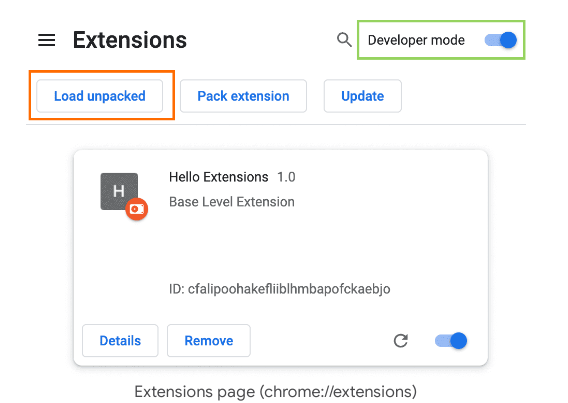
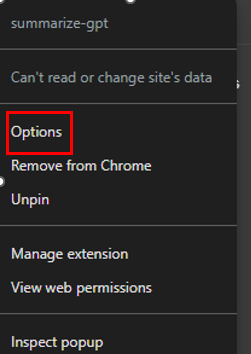
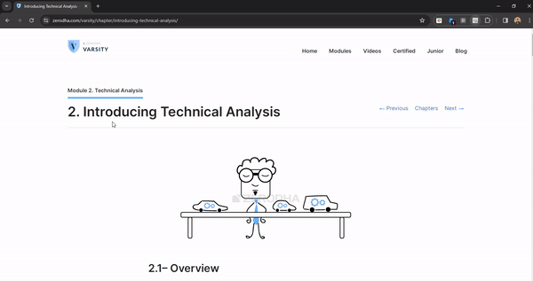

<div align="center">
    <br>
    <h1>SUMMARIZE-GPT</h1>
    
    <br>
</div>


### What is summarize-gpt?

summarize-gpt is a chrome extension that can be used to summarize the content on any web page. It extracts the text-content from the website that you are viewing and uses the google-gemini API to summarise the content.


### Installing summarize-gpt

You can add the extension from [chrome web store](https://chromewebstore.google.com/detail/fcpgdlnekpdnajmgkchjdnmfnangcecp?hl=en-GB). Or follow the steps below

- Clone/Download this repo
- Go to the Extensions page by entering ```chrome://extensions``` in a new tab.
- Enable Developer Mode by clicking the toggle switch next to Developer mode
- Click Load Unpacked button and select the extension directory.

    

- Pin the extension to toolbar for quick access

### How to use summarize-gpt?

- Before using the extension to summarize a web page you need to configure the Google-gemini API key in the extension options
- Right click on the extension icon and click on options.

    

- Follow the steps to generate and configure the API key
- Now you are ready to use the extension

 

### Credits

I have made use of [chrome extension docs](https://developer.chrome.com/docs/extensions/get-started/tutorial/hello-world) to create this guide.